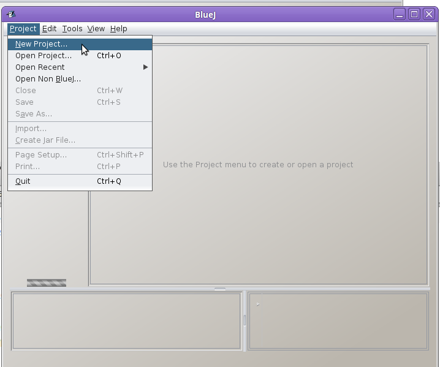
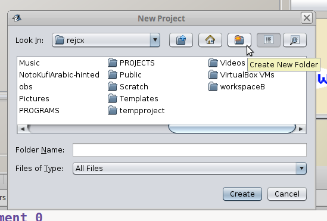

# CS 134 - CodePad Lab 1
## Data Types, Math Operators, and the Assignment Operator

Last updated 2016-08-25

---

# Introduction

We are going to explore some simple Java commands by using
the **CodePad** tool in the **BlueJ** program.

Each of these comands are single-line statements,
and after entering one statement, CodePad may display
some results - such as errors, updated variable values,
and more.

---

# Getting Started

## 1. Open BlueJ

1. Click the "Start Menu" (in Windows 10, this looks like the Windows logo in the bottom-left corner of the screen),
2. Click on "All Apps" at the bottom of this menu.
3. Under the "B" section, open the "BlueJ" folder and select BlueJ.

## 2. Create a new project

1. From the BlueJ window, go to **Project** and select **New Project...**

2. Click on the **Create new folder** icon, and name it "Code Pad Lab 1".
3. Click on the **Create** button while your new folder is highlighted.

## 3. View CodePad

1. From BlueJ, go to **View** and select **Show Code Pad**.

2. You can resize the CodePad window by clicking and dragging its top and left borders.

---

